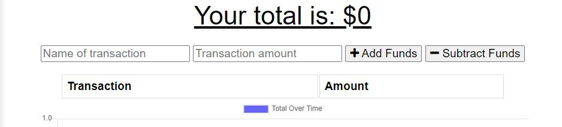
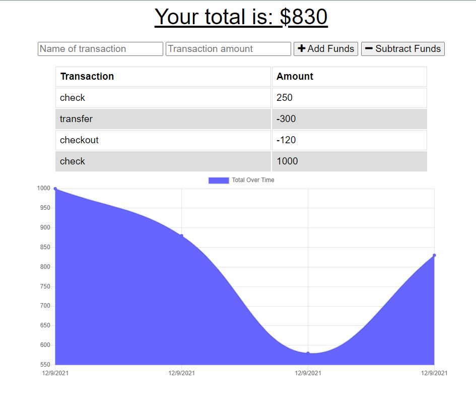

# budget-tracker
This project is a Progressive Web Application (PWA) used to track a budget. 

# Features
* A user can enter transactions to either add funds or subtract funds

The updated total is kept at the top

* Once you start entering in budget information a table is created with your transaction history and a graph is presented to track your budget over time

* The application works when the user is not connected to the internet
* Data entered while offline will be saved in the indexedDB until the application is reconnected to the internet, then it sends the stored information to be put into the database.

# References
Link to repository: https://github.com/Jaron15/budget-tracker.git

link to deployed application: https://lit-wildwood-12066.herokuapp.com/
